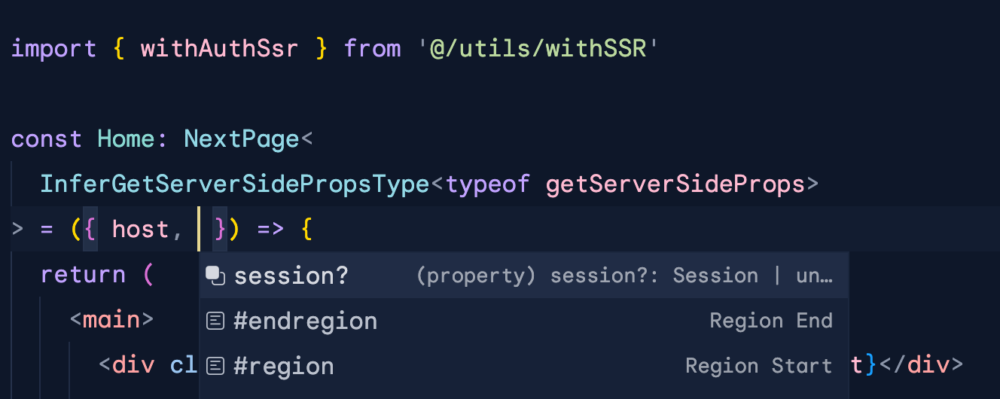

# nextauthjs-server-side-props-wrapper



I wrote this POC to protect authenticated SSR pages with NextAuth.js
at render time.

I wanted to enjoy the benefits of `InferGetServerSidePropsType` as well,
especially since I'm using this in an enviornmnent where `prisma` could
return some gnarly objects to traverse. 

This little snippet shows how I went about composing my components in a
reusable way that would play nicely with prop type inference.

When you wrap your `getServerSideProps` function with `withAuthSsr`, 
you'll be able to access the `session` object inside of the `req` 
context of your SSR function, like so:

```ts
export const getServerSideProps = withAuthSsr(
  async ({ req }) => {
    
    const dataForUser = await lookupByUserId(req.session.user.id)

    return {
      props: {
        dataForUser,
        ...(req.session && { session: req.session })
      }
    }
  }
)
```

You can pass an optional second parameter in the form of a URL to automatically redirect unauthenticated users, for example:

```ts
export const getServerSideProps = withAuthSsr(
  async ({ req }) => { return { props: { /* props */ }}  },
  '/auth/login'
)
```

I'm still learning so please feel free to submit any corrections or improvements.

I hope this can help you in a project of your own!

This was inspired by similar implementations from [iron-session](https://github.com/vvo/iron-session/blob/cfa5c808bbe7d6ef6b88daa603d8aca7af7ae830/next/index.ts) and [next-firebase-auth](https://github.com/gladly-team/next-firebase-auth/blob/6df19d9010dd3cf5b8f3c654c6d4a04e6878ef21/src/withAuthUserTokenSSR.js).